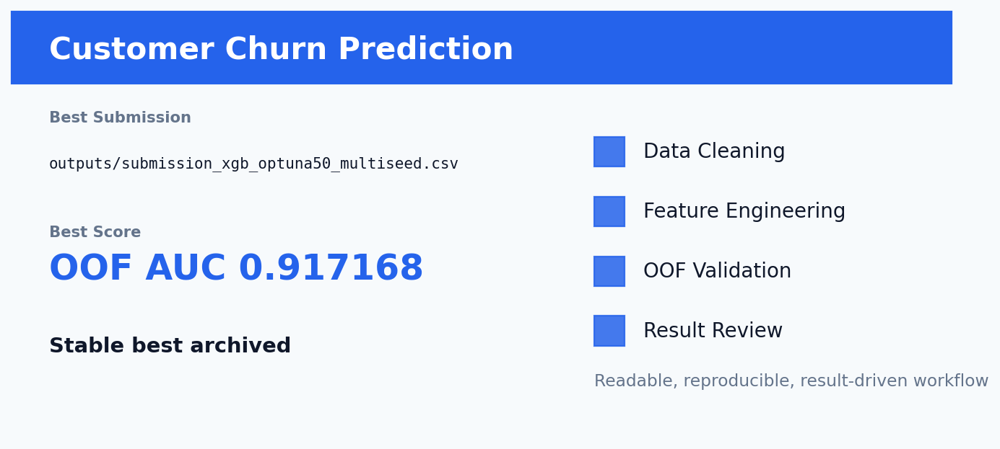

# Kaggle 客户流失预测



## 项目一句话

根据客户属性预测是否流失，目标列为 Churn。

这个项目不是简单跑一个 baseline，而是围绕 **数据清洗 -> 特征工程 -> 稳定验证 -> 模型融合 -> 线上结果复盘** 做成一条完整建模链路。核心目标是：让模型不仅分数高，而且每一步为什么有效都能讲清楚。

## 当前结果

| 项目 | 内容 |
| --- | --- |
| Competition | `Kaggle Playground / Churn Binary Classification` |
| Metric | `ROC-AUC` |
| Best Submission | `outputs/submission_xgb_optuna50_multiseed.csv` |
| Best Score | OOF AUC 0.917168 |
| Validation / Extra | 线上验证后保留最佳 |
| Status | 稳定最佳版本已归档 |

## 数据清洗

- 统一识别 id 与 Churn，确保二者不进入训练特征。
- 检查 submission 行数、列顺序、缺失值、无穷值和预测范围。
- 类别特征统一编码，训练集和测试集合并后再拆分，避免编码错位。

## 特征工程亮点

- 在 baseline 特征上构造 FE 版本，并复用同一套 StratifiedKFold 验证框架。
- 保留类别信息给 CatBoost，同时为 LightGBM/XGBoost 准备数值化版本。
- 围绕用户状态、消费/服务变量做交叉、分箱和频次类增强，强化模型对高风险客户群的识别。

这部分是项目最重要的地方：特征不是随便堆出来的，而是尽量贴近业务或数据生成逻辑。我的思路是先问“这个变量为什么会影响目标”，再把这个想法翻译成模型能理解的数值、类别、比例、交叉或序列表示。

## 模型方法

- CatBoost、LightGBM、XGBoost 三模型 5 折 OOF。
- Optuna 搜索最强单模型，最终选择 XGBoost Optuna50 MultiSeed。
- 尝试均值融合、AUC 加权、rank averaging、OOF 权重搜索和 pseudo/fine blend，线上验证后回到最稳版本。

验证上尽量使用 OOF 思路，避免只看一次线上提交。融合也不是机械平均，而是根据 OOF、public/private 表现和模型互补性来选择。

## 结果分析

- FE 版本相对 baseline 的提升很小，说明原始特征已经强，后续收益主要来自调参和 seed 稳定性。
- 多 seed XGBoost 的 OOF AUC 达到 0.917168，是当前最稳定的泛化选择。
- 线上验证中更激进的 fine pseudo blend 未继续涨分，因此最终保留可复现、风险更低的版本。

## 如何复现

安装依赖：

```bash
pip install -r requirements.txt
```

复现时先从 Kaggle 下载原始数据到 README 或脚本约定的数据目录。部分仓库为了保持轻量，只保留最佳提交文件、实验日志和核心说明；如果仓库中存在 `src/`、`notebooks/` 或 `kaggle_kernel_*`，优先从这些入口运行训练。

常见入口示例：

```bash
python src/train_best.py
# 或在 Kaggle 上运行 kaggle_kernel_* 中的 GPU kernel
```

如果当前项目只保留了最佳产物，则可直接查看 `outputs/` 中的 OOF、prediction、submission 和实验摘要文件。

## 未来改进方向

- 做更细的业务交叉特征：客户活跃度、费用压力、服务状态组合。
- 尝试稳定 pseudo-label，但必须用 OOF 和线上反馈双重约束。
- 补充 SHAP 分析，把流失驱动因素解释成业务语言。

## 项目价值

这个项目可以体现三类能力：

- **建模能力**：能从 baseline 走到调参、融合和线上验证。
- **特征工程能力**：能把业务直觉、数据分布和模型输入连接起来。
- **复盘能力**：能说明为什么涨分、为什么不涨，以及下一步该往哪里优化。
